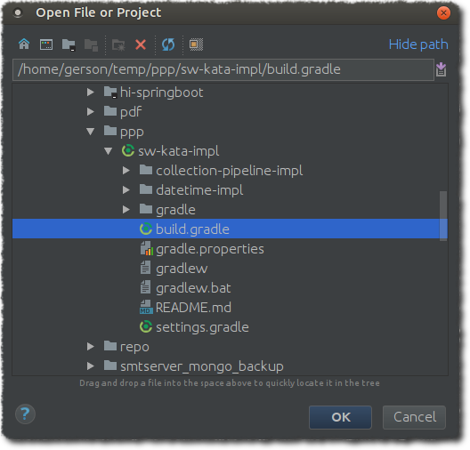
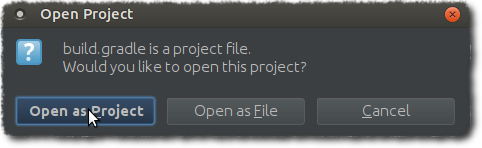
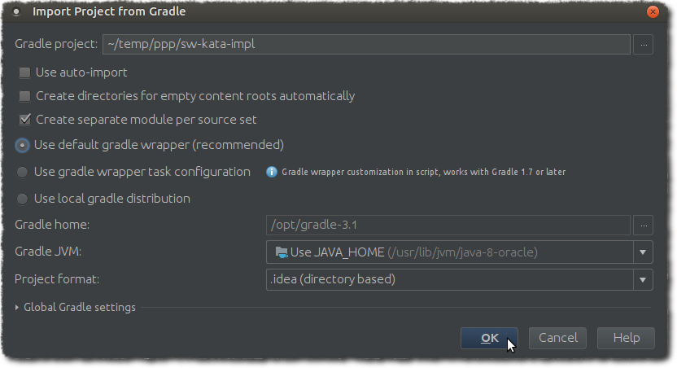
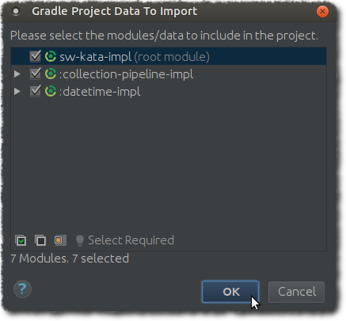
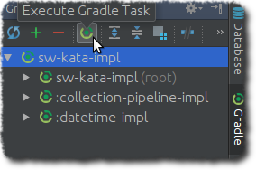

# sw-kata-impl
Projeto template para resolver os exercícios (code katas) do ws-kata (https://github.com/gersonkm/sw-kata).

- Collection Pipeline (Stream API)
- Date & Time

## Como preparar o ambiente?

#### Fork/Clone do projeto
1. Faça o **fork** deste repositório para a sua conta GitHub.
1. Faça o **clone** do repositório "forkado" para a sua máquina local.

#### Abrindo no IntelliJ
1. Abra o projeto com o IntelliJ selecionando o arquivo **build.gradle**.

    

2. Ao perguntar '*Would you like to open this project?*', escolha '**Open as Project**'.

    

3. Na caixa de diálogo '*Import Project from Gradle*', deixe marcado a opção '**User default gradle wrapper (recommended)**' e clique em '**OK**'.

    

4. Caso apareça a caixa de diálogo '*File Already Exists*', escolha '**Yes**' para confirmar a sobreescrita do arquivo.

5. Caso apareça a caixa de diálogo '*Open Project*', escolha '**Delete Existing Project and Import**'.

6. Em 'Gradle Project Data to Import', selecione todos os módulos.
 
    

#### Atualizando as dependências
Com o projeto carregado, clique em '**Refresh all Gradle projects**' para certificar que todas dependências foram baixadas e estão atualizadas (*com.github.gersonkm.sw-kata*).

## Links úteis
Links úteis:

  - https://kotlinlang.org/api/latest/jvm/stdlib/kotlin.collections/index.html
  - http://stackoverflow.com/documentation/kotlin/707/java-8-stream-equivalents

Livros:
  - https://www.manning.com/books/kotlin-in-action
  - https://antonioleiva.com/kotlin-android-developers-book/
